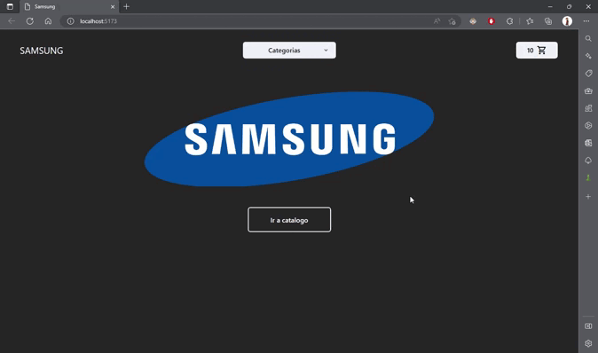

# E-commerce

Este es el proyecto final para el curso de react de coderhouse. Es una tienda virtual en donde se pueden comprar distintos dispositivos de Samsung.

---

El funcionamiento es sencillo, podes observar un catalogo de disposivos en el que al pulsar en el boton **Ver Más** te lleva a ver una descripcion mas detallada del dispositivo. Tambien es posible filtrar por distintas categorias y acceder al carrito desde el `NavBar`

---

## Pasos a seguir

1. [ x ] Crear un componente `NavBar`

2. [ x ] Dentro de `NavBar` colocar un logo, un menu desplegable y un componente llamado `CartWidget`

3. [ x ] Crear un `ItemCount` que cumplira con la funcion de elegir la cantidad de elementos que queremos agregar al carrito. Cuenta con un boton sumar, restar y resetar

4. [ x ] Crear un componente contenedor llamado `ItemListcontainer` 

5. [ x ] Dentro de el, uno llamado `ItemList` que a su vez haga un `map` de cada `Item` colocado en `data.json`

6. [ x ] Agregar navegacion basica en cada uno de los botones, menus y logos

---
## Gif Funcionamiento del e-commerce

