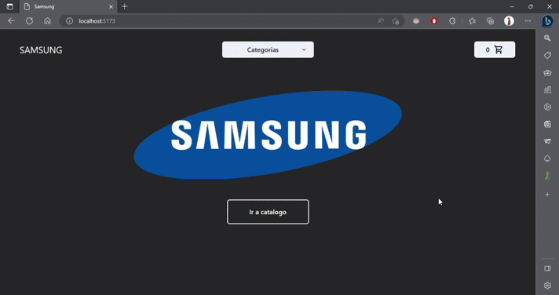

# E-commerce

Este es el proyecto final para el curso de react de coderhouse. Es una tienda virtual en donde se pueden comprar distintos dispositivos de Samsung.

---

El funcionamiento es sencillo, podes observar un catalogo de disposivos en el que al pulsar en el boton **Ver Más** te lleva a ver una descripcion mas detallada del dispositivo. Tambien es posible filtrar por distintas categorias y acceder al carrito desde el `NavBar`

---

Una vez se agrega un producto al carrito se muestra los detalles de la compra y es necesario rellenar un formulario, que al estar completo al cliente se le dara un codigo de seguimiento

---

## En este proyecto se implemento:

1. React Vite

2. Chakra UI

3. React Router DOM

4. Firebase

---
## Gif Funcionamiento del e-commerce

